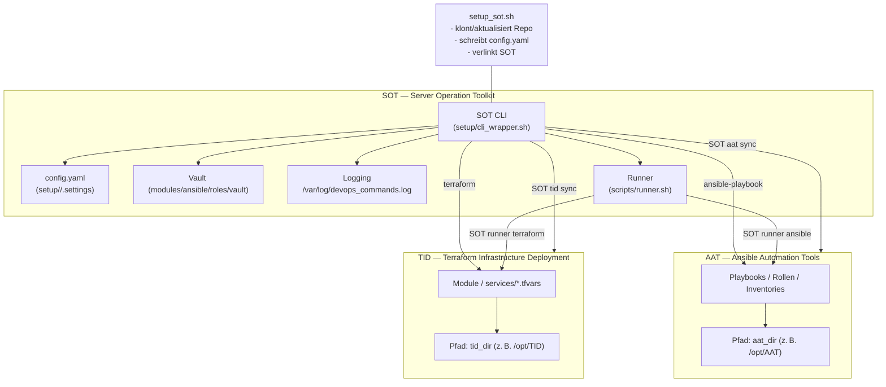

# SOT — Server Operation Toolkit

   

Das **Server Operation Toolkit (SOT)** liefert ein reproduzierbares Setup- und Operations-Framework
für Linux-Server. Im Mittelpunkt steht das CLI `SOT`, das Skripte strukturiert ausführt, zentrale Logs
schreibt und sensible Parameter via Ansible-Vault verwaltet. Das Toolkit orchestriert optionale
Integrationen wie **AAT** (Ansible Automation Tools) und **TID** (Terraform Infrastructure Deployment),
installiert benötigte Werkzeuge und stellt modulare Playbooks sowie Terraform-Einstiegspunkte bereit.

---

## Inhaltsverzeichnis

1. [Features](#features)
2. [Architekturüberblick](#architekturüberblick)
3. [Voraussetzungen](#voraussetzungen)
4. [Schnellstart](#schnellstart)
5. [Setup-Flags & Optionen](#setup-flags--optionen)
6. [CLI-Nutzung](#cli-nutzung)
7. [Konfiguration (`config.yaml`)](#konfiguration-configyaml)
8. [Module & Integrationen](#module--integrationen)
9. [Sicherheitsmanagement](#sicherheitsmanagement)
10. [Verzeichnisstruktur](#verzeichnisstruktur)
11. [Wartung & Fehlersuche](#wartung--fehlersuche)
12. [Best Practices](#best-practices)

---

## Features

- ✅ **Konsistentes CLI** – `SOT [ordner] <kommando>` löst Skripte automatisch auf, hängt
  Standardargumente (Konfigurationspfad, Module-Verzeichnis, Vault-Informationen usw.) an
  und protokolliert jeden Aufruf in `log_file`. Fehler werden wahlweise auf einen Default-Befehl
  (`help`) umgeleitet.【F:setup/cli_wrapper.sh†L10-L156】
- 🔧 **Geführtes Setup** – `setup/setup_sot.sh` generiert dynamische Standardwerte,
  legt Branch-spezifische Konfigurationsordner unter `setup/<branch>/.settings/` an und schreibt
  eine vollständige `config.yaml`, inklusive Vault-Pfaden, Runner-Parametern sowie Modul-/Skript-
  Verzeichnissen.【F:setup/setup_sot.sh†L122-L189】【F:setup/setup_sot.sh†L640-L792】
- 🧰 **Modularisierung wie in AAT/TID** – Alle Werkzeuge liegen unter `modules/`.
  `trigger_playbook.sh` kümmert sich um Inventare, Ansible-Konfiguration und optionale Docker-Installation,
  während `modules/docker/` und `modules/sdkman/` dedizierte Installationsskripte bereitstellen.【F:modules/ansible/trigger_playbook.sh†L9-L78】【F:setup/install_tools.sh†L11-L82】
- 🔄 **Repository-Sync & Runner** – `SOT aat sync` / `SOT tid sync` aktualisieren optionale Repos
  auf Basis der Konfiguration. `SOT runner` orchestriert Ad-hoc-Ansible- und Terraform-Läufe,
  erkennt Inventories/Stacks automatisch und protokolliert alle Befehle mit Zeitstempel.【F:scripts/integrations/aat_sync.sh†L3-L78】【F:scripts/integrations/tid_sync.sh†L3-L77】【F:scripts/runner.sh†L5-L399】
- 🛡️ **Vault-Workflows out-of-the-box** – Das Setup erzeugt Vault-Datei, Geheimnis und Startinhalt,
  die Rollen verschlüsseln den Inhalt bei Bedarf und `SOT vault` öffnet den Tresor über eine temporäre
  Passwortdatei.【F:setup/setup_sot.sh†L170-L187】【F:modules/ansible/roles/vault/tasks/main.yml†L3-L52】【F:scripts/vault.sh†L10-L57】

---

## Architekturüberblick



---

## Voraussetzungen

- Linux-System mit Root-Rechten (Symlink unter `/usr/sbin/`, Schreibrechte für Logs und Vault).
- `curl` für den Einzeiler sowie Paketmanager-Zugriff, damit fehlendes `git` installiert werden kann.【F:setup/setup_sot.sh†L248-L361】
- Optional: `ansible`, `docker`, `terraform`. Der Installer richtet bei Bedarf SDKMAN!, Docker
  und Ansible automatisiert ein.【F:setup/install_tools.sh†L14-L82】

---

## Schnellstart

### Einzeiler

```bash
BRANCH=${BRANCH:-production}
curl -fsSL "https://raw.githubusercontent.com/NiklasJavier/SOT/${BRANCH}/setup/setup_sot.sh" \
  | bash -s -- -branch "$BRANCH" -port "22" && SOT setup
```

> 🔁 Für Tests kann `BRANCH=dev` oder `BRANCH=staging` gesetzt werden. Ohne Vorgabe wird `production` verwendet.

### Was passiert?

1. `setup_sot.sh` klont das Repository (Standard `/etc/DevOpsToolkit`) und erstellt
   branch-spezifische `.settings`-Verzeichnisse unter `setup/<branch>/`.【F:setup/setup_sot.sh†L205-L367】【F:setup/setup_sot.sh†L426-L459】
2. `config.yaml` wird mit dynamischen Werten (Systemname, Ports, Vault, Runner, Module-Verzeichnis)
   gefüllt.【F:setup/setup_sot.sh†L640-L742】
3. Das CLI wird nach `/usr/sbin/SOT` verlinkt; alle Skripte erhalten Ausführungsrechte.【F:setup/setup_sot.sh†L517-L578】
4. `setup/install_tools.sh` installiert optionale Tools (Ansible, Docker, SDKMAN!).【F:setup/setup_sot.sh†L745-L756】【F:setup/install_tools.sh†L14-L82】
5. Zum Abschluss erhalten Sie eine Übersicht der wichtigsten Parameter.【F:setup/setup_sot.sh†L759-L792】

> 💡 Standardbranch ist `production`. Für Tests empfiehlt sich `-branch dev`.

---

## Setup-Flags & Optionen

| Flag | Beispiel | Beschreibung |
|------|----------|--------------|
| `-branch` | `-branch dev` | Erstellt branch-spezifische Settings (`setup/<branch>/.settings`) und setzt `use_defaults=true`.【F:setup/setup_sot.sh†L201-L215】【F:setup/setup_sot.sh†L426-L436】 |
| `-config` | `-config /tmp/custom.yml` | Lädt alternative Defaults (auch via `SOT_DEFAULT_CONFIG`).【F:setup/setup_sot.sh†L17-L58】【F:setup/setup_sot.sh†L191-L193】 |
| `-systemname` | `-systemname srv-demo` | Überschreibt den generierten Systemnamen (`SRV-<RANDOM>`).【F:setup/setup_sot.sh†L122-L133】 |
| `-key` | `-key "ssh-ed25519 AAAA..."` | Aktiviert SSH-Key-Funktion, speichert den Public Key in `config.yaml`.【F:setup/setup_sot.sh†L230-L271】【F:setup/setup_sot.sh†L640-L688】 |
| `-tools` | `-tools "ansible docker"` | Ergänzt Standardtool-Liste für den Installer.【F:setup/setup_sot.sh†L262-L277】【F:setup/install_tools.sh†L14-L82】 |
| `-aat_*` | `-aat_enabled true` | Steuert die optionale AAT-Integration (Repo-URL, Zielpfad).【F:setup/setup_sot.sh†L278-L330】【F:setup/setup_sot.sh†L721-L728】 |
| `-tid_*` | `-tid_dir /srv/TID` | Steuert die optionale TID-Integration.【F:setup/setup_sot.sh†L331-L380】【F:setup/setup_sot.sh†L726-L739】 |
| `-runner_*` | `-runner_mode ansible` | Konfiguriert Runner (Default-Modus, Sync-Verhalten, Verzeichnisse).【F:setup/setup_sot.sh†L150-L168】【F:setup/setup_sot.sh†L731-L739】 |

---

## CLI-Nutzung

```bash
SOT [unterordner] <kommando> [optionen]
```

- `SOT help` listet alle Skripte in `scripts/` (max. drei Ebenen tief).【F:setup/cli_wrapper.sh†L35-L47】
- Jedes Kommando erhält automatisch `modules_dir`, `config_file`, `vault_file`, `vault_secret`,
  `opt_data_dir`, `clone_dir`, `systemlink_path`, `log_file` und `branch`.【F:setup/cli_wrapper.sh†L90-L155】
- Aufrufe werden mit Timestamp und Benutzername in `log_file` protokolliert.【F:setup/cli_wrapper.sh†L30-L35】

### Befehlsübersicht

| Befehl | Ort | Zweck |
|--------|-----|-------|
| `SOT setup` | `scripts/setup.sh` | Führt das Playbook `host_setup.yml` über den Trigger aus (inkl. Inventory-Auflösung, Docker-/Ansible-Prüfung).【F:scripts/setup.sh†L9-L26】【F:modules/ansible/trigger_playbook.sh†L9-L78】 |
| `SOT vault` | `scripts/vault.sh` | Öffnet den Vault interaktiv über eine temporäre Passwortdatei.【F:scripts/vault.sh†L10-L57】 |
| `SOT runner` | `scripts/runner.sh` | Dynamische Orchestrierung von Ansible/Terraform inkl. Repo-Sync, Inventar-/Stack-Erkennung und Logging.【F:scripts/runner.sh†L5-L399】 |
| `SOT aat sync` | `scripts/integrations/aat_sync.sh` | Klont oder aktualisiert das AAT-Repository gemäß `config.yaml`.【F:scripts/integrations/aat_sync.sh†L3-L78】 |
| `SOT tid sync` | `scripts/integrations/tid_sync.sh` | Synchronisiert das TID-Repository mit Fallback auf Recloning.【F:scripts/integrations/tid_sync.sh†L3-L77】 |
| `SOT debug update` | `scripts/debug/update.sh` | Aktualisiert den bestehenden Clone (z. B. nach Git-Änderungen). |
| `SOT debug delete` | `scripts/debug/delete.sh` | Entfernt Toolkit, Vault und Symlink kontrolliert. |
| `SOT debug cleanup_old_users` | `scripts/debug/cleanup_old_users.sh` | Bereinigt Testbenutzer (`/home/<A-Z>{11}`) und UFW-Regeln nach Rückfrage. |

> Neue Befehle entstehen durch `.sh`-Dateien unter `scripts/` – der CLI-Aufruf entspricht dem Pfad.

---

## Konfiguration (`config.yaml`)

- Standardwerte liegen in `services/default_config.yml`. Platzhalter (`__GENERATE_*__`) werden während
  des Setups bzw. in den Ansible-Rollen ersetzt.【F:services/default_config.yml†L1-L37】
- `modules/ansible/config/load_config.yml` vereint Defaults und Overrides, generiert dynamische Werte
  (z. B. Module-Verzeichnis, Vault-Pfade) und stellt sie als `sot_config`-Facts bereit.【F:modules/ansible/config/load_config.yml†L2-L81】
- Die Rolle `variables` bindet das Playbook `config/load_config.yml` automatisch ein, sodass alle
  Playbooks auf konsistente Konfigurationswerte zugreifen können.【F:modules/ansible/roles/variables/tasks/main.yml†L1-L3】

| Schlüssel | Bedeutung | Beispiel |
|-----------|-----------|----------|
| `system_name`, `username` | Server-/Benutzerbezeichnungen für Ansible & Vault. | `SRV-ABCD1234`, `root` |
| `ssh_port` | SSH-Port für Firewalls & Playbooks. | `282` |
| `modules_dir`, `scripts_dir`, `pipelines_dir` | Verzeichnisse innerhalb des Clones. | `/etc/DevOpsToolkit/modules` |
| `tools` | Whitespace-separierte Liste für `setup/install_tools.sh` (SDKMAN!-Ketten via `sdkman:<kandidat>`). | `ansible docker sdkman:java=17,gradle` |
| `vault_*` | Vault-Datei, Secret, Template, Benachrichtigungsadresse. | `/opt/SRV-.../vault.yml`, `<60 chars>` |
| `aat_*`, `tid_*` | Steuerung optionaler Repos (URL, Zielpfad, Aktivierung). | siehe Tabelle oben |
| `runner_*` | Runner-Workflow (Default-Modus, Sync, Verzeichnisse). | `runner_enabled=true` |

Alle Skripte lesen `config.yaml` zeilenweise (`key: value`) und setzen daraus Shell-Variablen – neue Einträge sollten diesem Format folgen.【F:setup/cli_wrapper.sh†L10-L27】【F:scripts/integrations/aat_sync.sh†L32-L44】

---

## Module & Integrationen

### Ansible

- `modules/ansible` bildet die klassische Ansible-Struktur ab: globale `ansible.cfg`, Inventare,
  Playbooks und Rollen orientieren sich an AAT.【F:modules/ansible/README.md†L1-L23】
- Weitere Inventare können unter `modules/ansible/inventory/<name>/` abgelegt und über den
  `inventory_key` des Triggers genutzt werden.【F:modules/ansible/trigger_playbook.sh†L9-L78】

### Terraform

- `modules/terraform` dient als Platzhalter für lokale Module/Stacks, angelehnt an die Struktur von TID.【F:modules/terraform/README.md†L1-L11】
- `SOT runner terraform` erkennt Arbeitsverzeichnisse, `.tfvars`-Dateien und Workspaces automatisch
  und führt `plan`, `apply`, `destroy` inkl. Logging aus.【F:scripts/runner.sh†L294-L357】【F:scripts/runner.sh†L200-L206】

### Snippets & Templates

- Wiederverwendbare YAML-/Cloud-Init- oder Vault-Snippets können unter `snippets/` abgelegt werden.
  So lassen sich häufig benötigte Konfigurationen zentral verwalten.【F:snippets/README.md†L1-L12】

---

## Sicherheitsmanagement

- Das Vault-Template (`setup/vault_template.j2`) generiert sichere Standard-Geheimnisse und enthält
  Beispiele für weitergehende Konfigurationen.【F:setup/vault_template.j2†L1-L51】
- Die Rolle `vault` verschlüsselt neue Vault-Inhalte automatisch und räumt temporäre Dateien auf.【F:modules/ansible/roles/vault/tasks/main.yml†L3-L52】
- `SOT vault` öffnet den Vault interaktiv und entfernt das temporäre Passwort zuverlässig.【F:scripts/vault.sh†L10-L57】

---

## Verzeichnisstruktur

```
setup/                  # Bootstrap-Skripte & CLI
├── cli_wrapper.sh
├── install_tools.sh
├── setup_sot.sh
└── vault_template.j2
modules/                # Modul-Layer für Automatisierung
├── ansible/            # Ansible-Struktur inkl. Playbooks, Inventare, Rollen
├── docker/             # Docker-Installationsskript + Compose-Templates
├── sdkman/             # SDKMAN!-Installer
└── terraform/          # Platzhalter für Terraform-Module/Stacks
scripts/
├── setup.sh            # Standard-Playbook-Trigger
├── runner.sh           # Runner-Orchestrierung
├── vault.sh            # Vault-Interaktion
├── debug/              # Wartungsskripte
└── integrations/       # AAT-/TID-Syncs
services/default_config.yml
snippets/               # Wiederverwendbare Templates/Snippets
```

Weitere Details zu den Ansible-Ordnern finden sich in `modules/ansible/README.md`.

---

## Wartung & Fehlersuche

1. `SOT debug update` – Aktualisiert den bestehenden Clone (Git Pull & Rechte prüfen).
2. `SOT debug delete` – Entfernt Setup, Vault, Symlink und Logs kontrolliert.
3. Runner-Logs liegen unter `runner_log_dir` (`/opt/<system>/runner/logs` per Default).【F:setup/setup_sot.sh†L150-L168】【F:scripts/runner.sh†L164-L176】
4. CLI-Logs finden sich in `log_file` (Standard `/var/log/devops_commands.log`).【F:setup/cli_wrapper.sh†L30-L35】

---

## Best Practices

- **Branch-Isolation**: Nutzen Sie separate Branches (`production`, `staging`, `dev`) für parallele Profile.
- **Konfigurations-Overrides**: Legen Sie angepasste `config.yaml`-Dateien ab und übergeben Sie sie via `-config`.
- **Module erweitern**: Platzieren Sie eigene Rollen/Playbooks unter `modules/ansible/roles` bzw. `modules/ansible/playbooks`.
- **Regelmäßiger Sync**: Verwenden Sie `SOT aat sync` / `SOT tid sync` oder aktivieren Sie `runner_sync_before_run`, damit externe Repos stets aktuell sind.【F:scripts/integrations/aat_sync.sh†L46-L78】【F:scripts/runner.sh†L177-L195】
- **Secrets schützen**: Rotieren Sie `vault_secret` bei Bedarf und nutzen Sie `SOT vault`, um Änderungen nachvollziehbar durchzuführen.【F:setup/setup_sot.sh†L170-L187】【F:scripts/vault.sh†L10-L57】

---

## Lizenz

MIT License – siehe [LICENSE](LICENSE).
