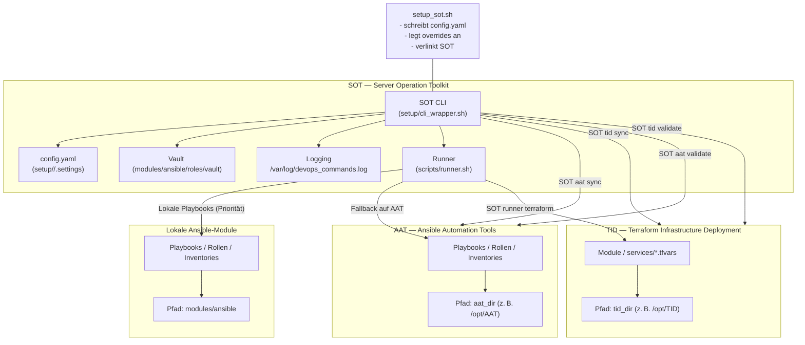

# SOT — Server Operation Toolkit

   

Das **Server Operation Toolkit (SOT)** liefert ein reproduzierbares Setup- und Operations-Framework
für Linux-Server. Im Mittelpunkt steht das CLI `SOT`, das Skripte strukturiert ausführt, zentrale Logs
schreibt und sensible Parameter via Ansible-Vault verwaltet. Das Toolkit orchestriert optionale
Integrationen wie **AAT** (Ansible Automation Tools) und **TID** (Terraform Infrastructure Deployment),
installiert benötigte Werkzeuge und stellt modulare Playbooks sowie Terraform-Einstiegspunkte bereit.

---

## Inhaltsverzeichnis

1. [Features](#features)
2. [Architekturüberblick](#architekturüberblick)
3. [Voraussetzungen](#voraussetzungen)
4. [Schnellstart](#schnellstart)
5. [Setup-Flags & Optionen](#setup-flags--optionen)
6. [CLI-Nutzung](#cli-nutzung)
7. [Konfiguration (`config.yaml`)](#konfiguration-configyaml)
8. [Module & Integrationen](#module--integrationen)
9. [Sicherheitsmanagement](#sicherheitsmanagement)
10. [Verzeichnisstruktur](#verzeichnisstruktur)
11. [Wartung & Fehlersuche](#wartung--fehlersuche)
12. [Best Practices](#best-practices)

---

## Features

- ✅ **Konsistentes CLI** – `SOT [ordner] <kommando>` löst Skripte automatisch auf, hängt
  Standardargumente (Konfigurationspfad, Module-Verzeichnis, Vault-Informationen usw.) an
  und protokolliert jeden Aufruf in `log_file`. Fehler werden wahlweise auf einen Default-Befehl
  (`help`) umgeleitet.【F:setup/cli_wrapper.sh†L10-L156】
- 🔧 **Geführtes Setup** – `setup/setup_sot.sh` generiert dynamische Standardwerte,
  legt Branch-spezifische Konfigurationsordner unter `setup/<branch>/.settings/` an und schreibt
  eine vollständige `config.yaml`, inklusive Vault-Pfaden, Runner-Parametern sowie Modul-/Skript-
  Verzeichnissen.【F:setup/setup_sot.sh†L122-L189】【F:setup/setup_sot.sh†L640-L792】
- 🧰 **Lokale Priorität & externe Integrationen** – Alle Werkzeuge liegen unter `modules/`.
  Lokale Playbooks in `modules/ansible/` werden vom Runner bevorzugt und erst wenn kein Treffer
  vorhanden ist, greift SOT auf die synchronisierten AAT-Playbooks zurück.【F:scripts/runner.sh†L131-L214】【F:scripts/runner.sh†L432-L542】
  Terraform-Module befinden sich ausschließlich im TID-Repository; SOT kümmert sich um das Syncen
  und die Ausführung.【F:scripts/runner.sh†L265-L364】【F:scripts/tid/sync.sh†L1-L113】
- 🔄 **Repository-Sync & Runner** – `SOT aat sync` / `SOT tid sync` aktualisieren optionale Repos
  auf Basis der Konfiguration. `SOT runner` orchestriert Ad-hoc-Ansible- und Terraform-Läufe,
  erkennt Inventories/Stacks automatisch und protokolliert alle Befehle mit Zeitstempel.【F:scripts/aat/sync.sh†L3-L78】【F:scripts/tid/sync.sh†L3-L77】【F:scripts/runner.sh†L5-L399】
- 🛡️ **Vault-Workflows out-of-the-box** – Das Setup erzeugt Vault-Datei, Geheimnis und Startinhalt,
  die Rollen verschlüsseln den Inhalt bei Bedarf und `SOT vault open` öffnet den Tresor über eine temporäre
  Passwortdatei.【F:setup/setup_sot.sh†L170-L187】【F:modules/ansible/roles/vault/tasks/main.yml†L3-L52】【F:scripts/vault/open.sh†L1-L55】

---

## Architekturüberblick



---

## Voraussetzungen

- Linux-System mit Root-Rechten (Symlink unter `/usr/sbin/`, Schreibrechte für Logs und Vault).
- `curl` für den Einzeiler sowie Paketmanager-Zugriff, damit fehlendes `git` installiert werden kann.【F:setup/setup_sot.sh†L248-L361】
- Optional: `ansible`, `docker`, `terraform`. Der Installer richtet bei Bedarf SDKMAN!, Docker
  und Ansible automatisiert ein.【F:setup/install_tools.sh†L14-L82】

---

## Schnellstart

### Einzeiler

```bash
SOT_BRANCH=${SOT_BRANCH:-production} && AAT_BRANCH=${AAT_BRANCH:-main} && TID_BRANCH=${TID_BRANCH:-main}
curl -fsSL "https://raw.githubusercontent.com/NiklasJavier/SOT/${SOT_BRANCH}/setup/setup_sot.sh" \
  | bash -s -- -branch "$SOT_BRANCH" -port "22" && \
  SOT aat sync --branch "$AAT_BRANCH" && \
  SOT tid sync --branch "$TID_BRANCH" && \
  SOT aat validate && \
  SOT tid validate && \
  SOT setup && \
  SOT aat run /opt/AAT/playbooks/test-playbook.yml
```

> 🔁 Branch-Strategie: `production` bleibt der stabile Default (z. B. für Rollouts), `dev` liefert den aktuellen Entwicklungsstand. Setzen Sie bei Bedarf `SOT_BRANCH=dev`, um den aktiven Stand auszuprobieren; ohne Vorgabe greift `production`.

### Was passiert?

1. `setup_sot.sh` klont das Repository (Standard `/etc/DevOpsToolkit`) und erstellt
   branch-spezifische `.settings`-Verzeichnisse unter `setup/<branch>/`.【F:setup/setup_sot.sh†L205-L367】【F:setup/setup_sot.sh†L426-L459】
2. `config.yaml` wird mit dynamischen Werten (Systemname, Ports, Vault, Runner, Module-Verzeichnis,
   lokale Ansible-Pfade, Overrides-Verzeichnis) gefüllt.【F:setup/setup_sot.sh†L640-L742】
3. Das CLI wird nach `/usr/sbin/SOT` verlinkt; alle Skripte erhalten Ausführungsrechte.【F:setup/setup_sot.sh†L517-L578】
4. `SOT aat sync` / `SOT tid sync` ziehen die externen Repos anhand der konfigurierten Branches,
   anschließend prüfen `SOT aat validate` und `SOT tid validate` die Ergebnisse.【F:scripts/aat/sync.sh†L1-L127】【F:scripts/tid/sync.sh†L1-L126】【F:scripts/aat/validate.sh†L1-L73】【F:scripts/tid/validate.sh†L1-L68】
5. `setup/install_tools.sh` installiert optionale Tools (Ansible, Docker, SDKMAN!).【F:setup/setup_sot.sh†L745-L756】【F:setup/install_tools.sh†L14-L82】
6. Zum Abschluss erhalten Sie eine Übersicht der wichtigsten Parameter.【F:setup/setup_sot.sh†L759-L792】

> 💡 Standardbranch ist `production` (stabil). Für Tests oder Entwicklung empfiehlt sich `-branch dev` (aktiver Stand).

---

## Setup-Flags & Optionen

| Flag | Beispiel | Beschreibung |
|------|----------|--------------|
| `-branch` | `-branch dev` | Erstellt branch-spezifische Settings (`setup/<branch>/.settings`) und setzt `use_defaults=true`.【F:setup/setup_sot.sh†L201-L215】【F:setup/setup_sot.sh†L426-L436】 |
| `-config` | `-config /tmp/custom.yml` | Lädt alternative Defaults (auch via `SOT_DEFAULT_CONFIG`).【F:setup/setup_sot.sh†L17-L58】【F:setup/setup_sot.sh†L191-L193】 |
| `-systemname` | `-systemname srv-demo` | Überschreibt den generierten Systemnamen (`SRV-<RANDOM>`).【F:setup/setup_sot.sh†L122-L133】 |
| `-key` | `-key "ssh-ed25519 AAAA..."` | Aktiviert SSH-Key-Funktion, speichert den Public Key in `config.yaml`.【F:setup/setup_sot.sh†L230-L271】【F:setup/setup_sot.sh†L640-L688】 |
| `-tools` | `-tools "ansible docker"` | Ergänzt Standardtool-Liste für den Installer.【F:setup/setup_sot.sh†L262-L277】【F:setup/install_tools.sh†L14-L82】 |
| `-aat_*` | `-aat_enabled true` | Steuert die optionale AAT-Integration (Repo-URL, Zielpfad).【F:setup/setup_sot.sh†L278-L330】【F:setup/setup_sot.sh†L721-L728】 |
| `-tid_*` | `-tid_dir /srv/TID` | Steuert die optionale TID-Integration.【F:setup/setup_sot.sh†L331-L380】【F:setup/setup_sot.sh†L726-L739】 |
| `-runner_*` | `-runner_mode ansible` | Konfiguriert Runner (Default-Modus, Sync-Verhalten, Verzeichnisse).【F:setup/setup_sot.sh†L150-L168】【F:setup/setup_sot.sh†L731-L739】 |

Zusätzlich stehen feinere Schalter zur Verfügung:

- `-local_ansible_enabled true|false` – Aktiviert oder deaktiviert lokale Playbooks komplett.【F:setup/setup_sot.sh†L347-L355】
- `-local_ansible_priority true|false` – Steuert, ob lokale Playbooks Vorrang vor AAT haben.【F:setup/setup_sot.sh†L356-L364】
- `-local_ansible_dir <pfad>` – Überschreibt das lokale Playbook-Verzeichnis (Standard: `modules/ansible`).【F:setup/setup_sot.sh†L365-L373】
- `-overrides_dir <pfad>` – Legt das Zielverzeichnis für `services/overrides` fest.【F:setup/setup_sot.sh†L374-L382】
- `-aat_branch <name>` / `-tid_branch <name>` – Syncen die Integrationen aus alternativen Branches.【F:setup/setup_sot.sh†L383-L400】

---

## CLI-Nutzung

```bash
SOT [unterordner] <kommando> [optionen]
```

- `SOT help` listet alle Skripte in `scripts/` (max. drei Ebenen tief).【F:setup/cli_wrapper.sh†L35-L47】
- Jedes Kommando erhält automatisch `modules_dir`, `config_file`, `vault_file`, `vault_secret`,
  `opt_data_dir`, `clone_dir`, `systemlink_path`, `log_file` und `branch`.【F:setup/cli_wrapper.sh†L90-L155】
- Aufrufe werden mit Timestamp und Benutzername in `log_file` protokolliert.【F:setup/cli_wrapper.sh†L30-L35】

### Befehlsübersicht

| Befehl | Ort | Zweck |
|--------|-----|-------|
| `SOT setup` | `scripts/setup.sh` | Führt das Playbook `host_setup.yml` über den Trigger aus (inkl. Inventory-Auflösung, Docker-/Ansible-Prüfung).【F:scripts/setup.sh†L9-L26】【F:modules/ansible/trigger_playbook.sh†L9-L78】 |
| `SOT vault open` | `scripts/vault/open.sh` | Öffnet den Vault interaktiv über eine temporäre Passwortdatei.【F:scripts/vault/open.sh†L1-L55】 |
| `SOT vault init` | `scripts/vault/init.sh` | Erstellt (falls nötig) eine Vault-Datei aus dem Template und verschlüsselt sie mit dem Secret.【F:scripts/vault/init.sh†L1-L63】 |
| `SOT vault status` | `scripts/vault/status.sh` | Prüft Existenz, Verschlüsselung und Secret-Kompatibilität des Vaults.【F:scripts/vault/status.sh†L1-L62】 |
| `SOT runner` | `scripts/runner.sh` | Orchestriert lokale Playbooks mit Vorrang, greift bei Bedarf auf AAT zurück und führt Terraform über TID aus.【F:scripts/runner.sh†L131-L214】【F:scripts/runner.sh†L432-L586】 |
| `SOT aat sync` | `scripts/aat/sync.sh` | Klont oder aktualisiert das AAT-Repository inkl. Branch-Auswahl.【F:scripts/aat/sync.sh†L1-L127】 |
| `SOT aat validate` | `scripts/aat/validate.sh` | Validiert Branch und Pflichtdateien des AAT-Repositories nach einem Sync.【F:scripts/aat/validate.sh†L1-L73】 |
| `SOT tid sync` | `scripts/tid/sync.sh` | Synchronisiert das TID-Repository mit Branch-Steuerung und Fallback auf Recloning.【F:scripts/tid/sync.sh†L1-L126】 |
| `SOT tid validate` | `scripts/tid/validate.sh` | Prüft Branch und zentrale Module im TID-Repository.【F:scripts/tid/validate.sh†L1-L68】 |
| `SOT debug update` | `scripts/debug/update.sh` | Aktualisiert den bestehenden Clone (z. B. nach Git-Änderungen). |
| `SOT debug delete` | `scripts/debug/delete.sh` | Entfernt Toolkit, Vault und Symlink kontrolliert. |
| `SOT debug cleanup_old_users` | `scripts/debug/cleanup_old_users.sh` | Bereinigt Testbenutzer (`/home/<A-Z>{11}`) und UFW-Regeln nach Rückfrage. |

> Neue Befehle entstehen durch `.sh`-Dateien unter `scripts/` – der CLI-Aufruf entspricht dem Pfad.

---

## Konfiguration (`config.yaml`)

- Standardwerte liegen in `services/default_config.yml` und folgen einem verschachtelten
  `sot`-Objekt. Platzhalter (`__GENERATE_*__`) werden während des Setups bzw. in den
  Ansible-Rollen ersetzt.【F:services/default_config.yml†L1-L37】
- `modules/ansible/config/load_config.yml` liest die neue Struktur, mapt sie zurück auf die
  bekannten `sot_config`-Felder und ergänzt fehlende Werte (z. B. Vault-Datei oder Module-Pfad).【F:modules/ansible/config/load_config.yml†L2-L103】
- Die Rolle `variables` bindet das Playbook `config/load_config.yml` automatisch ein, sodass alle
  Playbooks auf konsistente Konfigurationswerte zugreifen können.【F:modules/ansible/roles/variables/tasks/main.yml†L1-L3】

Wichtige Bereiche innerhalb der neuen Struktur:

- `sot.branch` – aktiver Toolkit-Branch (Standard `production`).
- `sot.user.*` – Benutzer- und Systeminformationen (`system_name`, `username`, `ssh_port`).
- `sot.paths.*` – FHS-konforme Pfade: Code/Clone unter `/opt/sot`, Konfiguration unter
  `/etc/sot`, Arbeitsdaten z. B. in `/var/lib/sot`, Logs in `/var/log/sot`.
- `sot.logging.*` – CLI-Logging (`file`, `level`).
- `sot.vault.*` – Vault-Datei und Secret (Standard `/etc/sot/vault.yml`).
- `sot.ansible.local.*` – Steuerung lokaler Playbooks (`enabled`, `priority`, `dir`).
- `sot.runner.*` – Runner-Vorgaben (Modus, Sync-Verhalten, Arbeits-/Log-Verzeichnisse).
- `sot.aat.*` und `sot.tid.*` – Integrations-relevante Parameter (Repo, Branch, Zielpfad,
  Inventory-Pfade). Die Felder `inventory.vars` dürfen als Whitespace-separierte Liste
  angegeben werden und werden intern zu Variablen expandiert.

Damit bleiben die bisherigen `sot_config.*`-Facts verfügbar, gleichzeitig erhalten
Installationen eine klare Trennung von Code (`/opt/sot`), Konfigurationsdateien (`/etc/sot`)
und Logs (`/var/log/sot`).

Der CLI-Wrapper sowie die Integrations-Skripte verwenden `setup/config_loader.py`, um die YAML-Struktur robust via Python zu parsen; neue Felder müssen daher nur innerhalb des `sot`-Baums ergänzt werden.【F:setup/cli_wrapper.sh†L10-L67】【F:setup/config_loader.py†L1-L238】【F:scripts/aat/sync.sh†L32-L66】

---

## Module & Integrationen

### Lokale Ansible-Inhalte

- `modules/ansible/` bleibt die erste Anlaufstelle für Playbooks, Inventare und Rollen. Der Runner
  durchsucht dieses Verzeichnis vor jeder AAT-Integration.【F:scripts/runner.sh†L131-L214】
- Branch- oder kundenbezogene Variablen können über `services/overrides/` abgelegt werden; das Setup
  erzeugt das Verzeichnis automatisch.【F:setup/setup_sot.sh†L600-L614】【F:modules/ansible/config/load_config.yml†L2-L86】
- `modules/ansible/trigger_playbook.sh` bleibt für direkte Aufrufe (`SOT setup`) zuständig und löst
  Inventare inklusive lokaler Overrides auf.【F:modules/ansible/trigger_playbook.sh†L9-L78】

### AAT — Ansible Automation Tools

- `SOT aat sync` aktualisiert das externe Repository und erlaubt Branch-Auswahl.【F:scripts/aat/sync.sh†L1-L127】
- Der Runner nutzt AAT nur, wenn kein passendes lokales Playbook gefunden wird oder wenn lokale
  Playbooks deaktiviert sind.【F:scripts/runner.sh†L131-L214】【F:scripts/runner.sh†L480-L552】
- `SOT aat validate` prüft nach einem Sync, ob zentrale Dateien wie `playbooks/site.yml`
  verfügbar sind.【F:scripts/aat/validate.sh†L1-L73】
- Einen vollständigen Überblick über die verfügbaren Playbooks liefert die [AAT Playbook-Übersicht](https://github.com/NiklasJavier/AAT/blob/main/docs/README.md).

### TID — Terraform Infrastructure Deployment

- Terraform-Code lebt vollständig im TID-Repository; lokale Module unter `modules/terraform` wurden entfernt.
  `SOT tid sync` sorgt für einen sauberen Clone inklusive Branch-Steuerung.【F:scripts/tid/sync.sh†L1-L126】
- `SOT runner terraform` führt Stacks aus dem synchronisierten TID-Verzeichnis aus (Stacks, Services,
  Var-Dateien).【F:scripts/runner.sh†L265-L364】【F:scripts/runner.sh†L586-L637】
- `SOT runner terraform` erkennt Arbeitsverzeichnisse, `.tfvars`-Dateien und Workspaces automatisch
  und führt `plan`, `apply`, `destroy` inkl. Logging aus.【F:scripts/runner.sh†L294-L357】【F:scripts/runner.sh†L200-L206】
- `SOT tid validate` verifiziert Branch und Kernmodule nach dem Sync.【F:scripts/tid/validate.sh†L1-L68】
- Die [TID Service-Übersicht](https://github.com/NiklasJavier/TID/blob/main/docs/README.md) beschreibt alle bereitgestellten Terraform-Services und deren Struktur.

### Snippets & Templates

- Wiederverwendbare YAML-/Cloud-Init- oder Vault-Snippets können unter `snippets/` abgelegt werden.
  So lassen sich häufig benötigte Konfigurationen zentral verwalten.【F:snippets/README.md†L1-L12】

---

## Sicherheitsmanagement

- Das Vault-Template (`setup/vault_template.j2`) generiert sichere Standard-Geheimnisse und enthält
  Beispiele für weitergehende Konfigurationen.【F:setup/vault_template.j2†L1-L51】
- Die Rolle `vault` verschlüsselt neue Vault-Inhalte automatisch und räumt temporäre Dateien auf.【F:modules/ansible/roles/vault/tasks/main.yml†L3-L52】
- `SOT vault open` öffnet den Vault interaktiv und entfernt das temporäre Passwort zuverlässig.【F:scripts/vault/open.sh†L1-L55】

---

## Verzeichnisstruktur

```
setup/                  # Bootstrap-Skripte & CLI
├── cli_wrapper.sh
├── install_tools.sh
├── setup_sot.sh
└── vault_template.j2
modules/                # Modul-Layer für Automatisierung
├── ansible/            # Ansible-Struktur inkl. Playbooks, Inventare, Rollen
├── docker/             # Docker-Installationsskript + Compose-Templates
└── sdkman/             # SDKMAN!-Installer
scripts/
├── setup.sh            # Standard-Playbook-Trigger
├── runner.sh           # Runner (lokale Priorität + Integrationen)
├── vault.sh            # Kompatibler Alias für `vault/open`
├── vault/              # Vault-Kommandos (open/init/status)
├── aat/                # AAT-Befehle (sync, validate)
├── tid/                # TID-Befehle (sync, validate)
├── compat/             # Übergangs-Shims für alte Namen
└── debug/              # Wartungsskripte
services/
├── default_config.yml
└── overrides/          # Umgebungsspezifische Konfigurationen
snippets/               # Wiederverwendbare Templates/Snippets
```

Weitere Details zu den Ansible-Ordnern finden sich in `modules/ansible/README.md`.

---

## Wartung & Fehlersuche

1. `SOT debug update` – Aktualisiert den bestehenden Clone (Git Pull & Rechte prüfen).
2. `SOT debug delete` – Entfernt Setup, Vault, Symlink und Logs kontrolliert.
3. Runner-Logs liegen unter `runner_log_dir` (`/opt/<system>/runner/logs` per Default).【F:setup/setup_sot.sh†L150-L168】【F:scripts/runner.sh†L164-L176】
4. CLI-Logs finden sich in `log_file` (Standard `/var/log/devops_commands.log`).【F:setup/cli_wrapper.sh†L30-L35】

---

## Best Practices

- **Branch-Isolation**: Nutzen Sie separate Branches (`production`, `staging`, `dev`) für parallele Profile.
- **Konfigurations-Overrides**: Legen Sie angepasste `config.yaml`-Dateien ab und übergeben Sie sie via `-config`.
- **Module erweitern**: Platzieren Sie eigene Rollen/Playbooks unter `modules/ansible/roles` bzw. `modules/ansible/playbooks`.
- **Regelmäßiger Sync**: Verwenden Sie `SOT aat sync` / `SOT tid sync` oder aktivieren Sie `runner_sync_before_run`. Anschließend prüfen `SOT aat validate` und `SOT tid validate`, ob Schlüsseldateien vorhanden sind.【F:scripts/aat/sync.sh†L46-L115】【F:scripts/tid/sync.sh†L44-L115】【F:scripts/aat/validate.sh†L1-L73】【F:scripts/tid/validate.sh†L1-L68】【F:scripts/runner.sh†L177-L195】
- **Secrets schützen**: Rotieren Sie `vault_secret` bei Bedarf und nutzen Sie `SOT vault open`, um Änderungen nachvollziehbar durchzuführen.【F:setup/setup_sot.sh†L170-L187】【F:scripts/vault/open.sh†L1-L55】

---

## Lizenz

MIT License – siehe [LICENSE](LICENSE).
