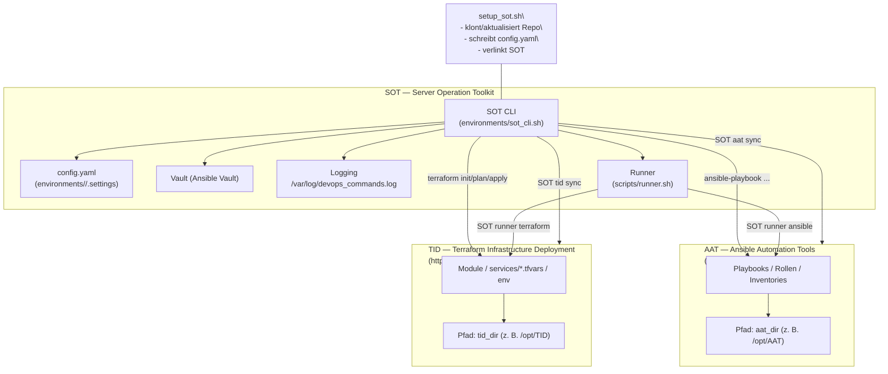

# SOT — Server Operation Toolkit

   

Das **Server Operation Toolkit (SOT)** stellt ein wiederholbares Setup- und Operations-Framework für Linux-Server bereit. Kern ist das CLI `SOT`, das Skripte strukturiert ausführt, zentrale Logs schreibt und sensible Parameter über einen Ansible-Vault verwaltet. Das Toolkit lässt sich per Einzeiler ausrollen, hält optionale Abhängigkeiten wie das Ansible-Repository **AAT** und das Terraform-Repository **TID** synchron und bietet Playbooks sowie Container-Templates für typische DevOps-Aufgaben.

---

## Inhaltsverzeichnis

1. [Highlights](#highlights)
2. [Architekturüberblick](#architekturüberblick)
3. [Schnelleinstieg](#schnelleinstieg)
4. [Setup-Flags & Optionen](#setup-flags--optionen)
5. [CLI-Nutzung](#cli-nutzung)
6. [Konfigurationsreferenz (`config.yaml`)](#konfigurationsreferenz-configyaml)
7. [Integration von AAT & TID](#integration-von-aat--tid)
8. [Ansible-Vault & Geheimnisse](#ansible-vault--geheimnisse)
9. [Verzeichnisstruktur](#verzeichnisstruktur)
10. [Wartung & Fehlersuche](#wartung--fehlersuche)
11. [Sicherheit & Best Practices](#sicherheit--best-practices)

---

## Highlights

- ✅ **Einheitliches CLI**: `SOT [ordner] <kommando>` verknüpft Skripte aus `scripts/` mit einer konsistenten Übergabe von Konfigurationsparametern und Logging.【F:environments/sot_cli.sh†L1-L85】【F:environments/sot_cli.sh†L87-L143】
- 🔐 **Sichere Konfiguration**: Setup erzeugt eine branch-spezifische `config.yaml` mit Vault-Pfaden, SSH-Parametern, Logs und Tool-Verzeichnissen; alle Skripte lesen daraus.【F:environments/setup_sot.sh†L400-L470】
- 🤖 **Automation Ready**: Enthält Ansible-Playbooks, Rollen und Trigger, Docker-Installationsskripte sowie Templates für Traefik, Portainer und Grafana.【F:tools/ansible/trigger_playbook.sh†L1-L25】【F:tools/ansible/trigger_playbook.sh†L27-L34】
- 🔄 **Repository-Sync**: `SOT aat sync` und `SOT tid sync` halten optionale Infrastruktur-Repos aktuell und respektieren die Einstellungen in `config.yaml`.【F:scripts/aat/sync.sh†L1-L74】【F:scripts/tid/sync.sh†L1-L71】
- 🚀 **Runner-Orchestrierung**: `SOT runner` startet dynamische Ansible- oder Terraform-Läufe, synchronisiert optional AAT/TID und schreibt Logs in ein dediziertes Runner-Verzeichnis.【F:scripts/runner.sh†L1-L275】
- 📜 **Auditierbar**: Jeder CLI-Aufruf landet in `log_file` (Standard `/var/log/devops_commands.log`).【F:environments/sot_cli.sh†L25-L31】

---

## Architekturüberblick



---

## Schnelleinstieg

### Voraussetzungen

- Linux-System mit Root-Rechten (CLI erstellt Symlink unter `/usr/sbin/` und schreibt nach `/var/log/`).【F:environments/setup_sot.sh†L248-L266】【F:environments/setup_sot.sh†L326-L361】
- `curl` für den Einzeiler sowie Paketmanager-Zugriff, damit fehlendes `git` installiert werden kann.【F:environments/setup_sot.sh†L273-L323】
- Optional: `ansible`, `docker`, `terraform` – können automatisiert über `install_tools.sh` eingerichtet werden.【F:environments/install_tools.sh†L1-L26】

### Einzeiler-Setup

```bash
curl -fsSL https://raw.githubusercontent.com/NiklasJavier/SOT/dev/environments/setup_sot.sh \
  | bash -s -- -branch dev -port "22" && SOT setup
```

Was passiert?

1. `setup_sot.sh` klont das Repository (Standard `/etc/DevOpsToolkit`) und erstellt branch-spezifische Settings.【F:environments/setup_sot.sh†L205-L226】【F:environments/setup_sot.sh†L328-L367】
2. `config.yaml` wird mit allen Parametern gefüllt (Systemname, Ports, Vault etc.).【F:environments/setup_sot.sh†L400-L470】
3. Ein Symlink `/usr/sbin/SOT` zeigt auf `environments/sot_cli.sh`; alle Skripte erhalten Ausführungsrechte.【F:environments/setup_sot.sh†L335-L361】
4. Optional ausgewählte Tools werden über `environments/install_tools.sh` installiert.【F:environments/install_tools.sh†L1-L30】
5. Abschließend erhalten Sie eine Übersicht der gesetzten Werte und können sofort `SOT setup` ausführen.【F:environments/setup_sot.sh†L472-L522】

> 💡 Standardbranch ist `production`. Für interaktive Tests empfiehlt sich `-branch dev`.

---

## Setup-Flags & Optionen

| Flag | Beispiel | Beschreibung |
|------|----------|--------------|
| `-branch` | `-branch dev` | Wählt `production`, `staging` oder `dev`; setzt `use_defaults=true` und legt Zielordner unter `environments/<branch>/` fest.【F:environments/setup_sot.sh†L37-L89】【F:environments/setup_sot.sh†L205-L214】 |
| `-config` | `-config /tmp/custom.yml` | Lädt Standardwerte aus einer alternativen Datei (`SOT_DEFAULT_CONFIG` wirkt identisch); sollte vor weiteren Flags kommen, damit deren Werte bestehen bleiben.【F:environments/setup_sot.sh†L17-L33】【F:environments/setup_sot.sh†L257-L264】 |
| `-full` | `-full true` | Reserviert für erweiterte Host-Setups (Wert in `FULL`).|
| `-systemname` | `-systemname srv-demo` | Überschreibt generierten Systemnamen (`SRV-<RANDOM>`).【F:environments/setup_sot.sh†L23-L58】 |
| `-username` | `-username alice` | Setzt Benutzerbezug für Logs, Vault-Backup und Dienstverzeichnisse.【F:scripts/debug/delete.sh†L10-L45】 |
| `-key` | `-key "ssh-ed25519 AAAA..."` | Aktiviert SSH-Key-Funktion und speichert Public Key in `config.yaml`.【F:environments/setup_sot.sh†L59-L119】【F:environments/setup_sot.sh†L415-L437】 |
| `-port` | `-port 2222` | SSH-Port für spätere Ansible- und Firewall-Konfigurationen.【F:environments/setup_sot.sh†L22-L70】【F:environments/setup_sot.sh†L404-L411】 |
| `-tools` | `-tools "ansible docker"` | Ergänzt Standardtool-Liste; weiterverarbeitet von `install_tools.sh`.【F:environments/setup_sot.sh†L17-L69】【F:environments/install_tools.sh†L1-L30】 |
| `-aat_url`, `-aat_dir`, `-aat_enabled` | `-aat_enabled true` | Steuerung der optionalen AAT-Integration (Git-URL, Zielpfad).【F:environments/setup_sot.sh†L70-L156】【F:environments/setup_sot.sh†L378-L412】 |
| `-tid_url`, `-tid_dir`, `-tid_enabled` | `-tid_dir /srv/TID` | Steuerung der optionalen TID-Integration.【F:environments/setup_sot.sh†L70-L156】【F:environments/setup_sot.sh†L412-L418】 |

---

## CLI-Nutzung

```bash
SOT [unterordner] <kommando> [optionen]
```

- Ohne Argumente zeigt `SOT help` alle verfügbaren Befehle aus `scripts/` an.【F:environments/sot_cli.sh†L33-L67】
- Alle Befehle erhalten automatisch Parameter wie `tools_dir`, `config_file`, `username`, `vault_file`, `opt_data_dir` usw.【F:environments/sot_cli.sh†L69-L93】
- Jeder Aufruf wird nach `log_file` protokolliert (Standard `/var/log/devops_commands.log`).【F:environments/sot_cli.sh†L25-L31】

### Befehlsübersicht

| Befehl | Ort | Zweck |
|--------|-----|-------|
| `SOT setup` | `scripts/setup.sh` | Startet das Standard-Playbook `host_setup.yml` (Ordner `tools/ansible/host`). Prüft Docker und triggert Ansible mit Übergabe von `CONFIG_YAML`.【F:scripts/setup.sh†L1-L24】【F:tools/ansible/trigger_playbook.sh†L1-L34】 |
| `SOT vault` | `scripts/vault.sh` | Öffnet bzw. verwaltet den Vault (siehe Vault-Abschnitt). |
| `SOT debug update` | `scripts/debug/update.sh` | Aktualisiert das Toolkit im vorhandenen Clone (z. B. für neue Skripte). |
| `SOT debug delete` | `scripts/debug/delete.sh` | Entfernt Toolkit, schreibt Vault-Zugangsdaten in Backup-Datei und löscht Symlink/Logfile.【F:scripts/debug/delete.sh†L1-L66】 |
| `SOT debug cleanUpOldUsers` | `scripts/debug/cleanUpOldUsers.sh` | Löscht Testbenutzer (`/home/<A-Z>{11}`) und bereinigt UFW-Regeln außerhalb des konfigurierten SSH-Ports – **mit Abfrage**.【F:scripts/debug/cleanUpOldUsers.sh†L1-L63】 |
| `SOT aat sync` | `scripts/aat/sync.sh` | Klont oder aktualisiert das Ansible-Zentralrepo entsprechend `config.yaml`.【F:scripts/aat/sync.sh†L1-L74】 |
| `SOT tid sync` | `scripts/tid/sync.sh` | Klont oder aktualisiert das Terraform-Repo entsprechend `config.yaml`.【F:scripts/tid/sync.sh†L1-L71】 |
| `SOT runner` | `scripts/runner.sh` | Führt dynamische Ansible- bzw. Terraform-Setups samt optionalem Repo-Sync und Logging aus.【F:scripts/runner.sh†L1-L275】 |

> ℹ️ Weitere Skripte können durch Hinzufügen von `.sh`-Dateien in `scripts/` oder Unterordnern ergänzt werden. Der Aufrufname entspricht dem Pfad (`SOT ordner kommando`).

---

## Konfigurationsreferenz (`config.yaml`)

Die Datei liegt unter `environments/<branch>/.settings/config.yaml` und wird beim Setup erzeugt bzw. aktualisiert.【F:environments/setup_sot.sh†L205-L230】【F:environments/setup_sot.sh†L400-L470】
Alle Standardwerte werden zentral in `tools/ansible/config/default_config.yml` gepflegt. Das Setup-Skript liest diese Datei ein,
erzeugt daraus dynamische Werte (z. B. Benutzernamen oder Vault-Geheimnisse) und schreibt anschließend die finale `config.yaml`.
Die Ansible-Rollen binden `tools/ansible/config/load_config.yml` ein, das die Defaults lädt, optionale Overrides validiert, dynamische Werte ergänzt und die Ergebnisse als `sot_config`-Fact bereitstellt.
【F:tools/ansible/config/default_config.yml†L1-L27】【F:tools/ansible/config/load_config.yml†L1-L81】【F:tools/ansible/host/roles/variables/tasks/main.yml†L1-L3】【F:tools/ansible/container/roles/variables/tasks/main.yml†L1-L3】

| Schlüssel | Bedeutung | Beispiel |
|-----------|-----------|----------|
| `system_name` | Server-/Host-Bezeichnung, wird von Playbooks als Hostname genutzt. | `SRV-ABCD1234` |
| `username` | Aktueller Benutzer, z. B. für Vault-Backups. | `root` |
| `ssh_port` | SSH-Port für Firewall- und Servicekonfiguration. | `282` |
| `log_level`, `log_file` | Steuerung der Logausgabe bzw. Speicherort. | `info`, `/var/log/devops_commands.log` |
| `opt_data_dir` | Basisverzeichnis für persistente Daten & Vault. | `/opt/SRV-ABCD1234` |
| `tools_dir`, `scripts_dir`, `pipelines_dir`, `clone_dir` | Pfade innerhalb des Toolkit-Clones. | `/etc/DevOpsToolkit/tools` |
| `systemlink_path` | Ziel des Systemsymlinks für das CLI. | `/usr/sbin/SOT` |
| `tools` | Whitespace-separierte Tool-Liste für `install_tools.sh`. | `ansible docker` |
| `ssh_key_function_enabled`, `ssh_key_public` | Aktiviert SSH-Key-Provisionierung. | `true`, `ssh-ed25519 ...` |
| `vault_file`, `vault_secret`, `vault_content`, `vault_mail` | Vault-Position, Secret sowie Template und Kontakt. | `/opt/SRV-.../vault.yml`, `<random 60 chars>` |
| `use_defaults` | Kennzeichnet, ob Setup ohne Interaktion lief. | `true` |
| `branch` | Aktiver Branch (`production`, `staging`, `dev`). | `dev` |
| `aat_*`, `tid_*` | Steuerung der optionalen Repo-Synchronisation. | Siehe [Integration](#integration-von-aat--tid) |

Skripte lesen die Datei zeilenweise (`key: value`) und setzen daraus Shell-Variablen – neue Einträge sollten diesem Format folgen.【F:environments/sot_cli.sh†L9-L23】【F:scripts/aat/sync.sh†L27-L49】

---

## Integration von AAT & TID

### AAT – Ansible Automation Tools

- Standardwerte: `aat_enabled=true`, `aat_repo_url=https://github.com/NiklasJavier/AAT.git`, `aat_dir=/opt/AAT`.【F:environments/setup_sot.sh†L70-L156】【F:environments/setup_sot.sh†L378-L408】
- `SOT aat sync` klont/pullt das Repo, sofern aktiviert, und legt fehlende Verzeichnisse automatisch an.【F:scripts/aat/sync.sh†L51-L74】
- Nach erfolgreichem Sync können Playbooks direkt referenziert werden, z. B. `ansible-playbook -i "$aat_dir/inventory/..." ...`.

### TID – Terraform Infrastructure Deployment

- Standardwerte: `tid_enabled=true`, `tid_repo_url=https://github.com/NiklasJavier/TID.git`, `tid_dir=/opt/TID`.【F:environments/setup_sot.sh†L70-L156】【F:environments/setup_sot.sh†L408-L418】
- `SOT tid sync` klont/pullt das Repo; Fehler bei `git pull` führen zu einem automatischen Recloning-Versuch.【F:scripts/tid/sync.sh†L31-L71】
- Nach dem Sync lassen sich Terraform-Befehle im Zielverzeichnis ausführen (`terraform init/plan/apply`).

> 📁 Beide Skripte respektieren `*_enabled != true` und beenden sich dann ohne Fehler.

### Runner – dynamische Setups mit AAT & TID

- `runner_enabled=true` sorgt dafür, dass `SOT runner` bereitsteht und eigene Arbeits-/Logverzeichnisse unterhalb von `runner_work_dir` und `runner_log_dir` anlegt (Standard: `/opt/<system>/runner` bzw. `…/logs`).【F:tools/ansible/config/default_config.yml†L26-L33】【F:environments/setup_sot.sh†L120-L139】【F:environments/setup_sot.sh†L520-L548】
- `SOT runner list` zeigt die aufgelösten Pfade und hilft bei der Fehlersuche (AAT/TID aktiviert? Pfade korrekt?).【F:scripts/runner.sh†L87-L121】
- `SOT runner ansible <playbook>` synchronisiert optional AAT, lädt `config.yaml` als Variablenbasis und führt das gewünschte Playbook inklusive Zusatzoptionen (`--inventory`, `--extra-var`, `--tags`, `--check` …) aus.【F:scripts/runner.sh†L123-L204】【F:scripts/runner.sh†L206-L246】
- `SOT runner terraform <stack>` erledigt `terraform init`, Workspace-Handling sowie `plan/apply/destroy` inklusive Variablen- und Auto-Approve-Optionen.【F:scripts/runner.sh†L248-L275】
- Alle Läufe landen mit Zeitstempel im Runner-Log, sodass wiederholbare Ad-hoc-Setups und Tests auditierbar bleiben.【F:scripts/runner.sh†L66-L85】【F:scripts/runner.sh†L198-L203】【F:scripts/runner.sh†L262-L270】

---

## Ansible-Vault & Geheimnisse

- Während des Setups werden `vault_file`, `vault_secret` und ein Startinhalt aus `vault_content.j2` erzeugt.【F:environments/setup_sot.sh†L430-L470】
- `SOT vault` erleichtert die Interaktion mit Ansible Vault (Ansicht/Bearbeitung; siehe Hinweis unten).
- `SOT debug delete` legt alle relevanten Vault-Zugangsdaten unter `${opt_data_dir}/devopsVaultAccessSecret-<username>.yml` ab und erstellt ein Hilfsskript `${opt_data_dir}/openVault.sh` zum Öffnen der Secrets.【F:scripts/debug/delete.sh†L10-L55】
- Empfehlung: Vault-Secret sicher archivieren und die generierte Hilfsdatei anschließend löschen.

_Hinweis:_ Das Skript `scripts/vault.sh` kann nach Bedarf erweitert werden, um weitere Vault-Workflows abzubilden.

---

## Verzeichnisstruktur

```text
environments/
  setup_sot.sh            # Bootstrap: Klonen, Config schreiben, Symlink anlegen
  sot_cli.sh              # CLI-Wrapper, wird als /usr/sbin/SOT verlinkt
  install_tools.sh        # Installiert gewünschte Tools (z. B. ansible, docker)
  vault_content.j2        # Template für initiale Vault-Inhalte
scripts/
  setup.sh                # Startet das Ansible-Standard-Setup
  vault.sh                # Vault-Operationen (öffnen/bearbeiten)
  debug/
    update.sh             # Toolkit-Update
    delete.sh             # Entfernt Toolkit & erstellt Vault-Backup
    cleanUpOldUsers.sh    # Bereinigt Testbenutzer & UFW-Regeln
  runner.sh              # Orchestriert AAT/TID-Läufe (ansible/terraform)
  aat/sync.sh             # Sync für AAT-Repo
  tid/sync.sh             # Sync für TID-Repo
tools/
  ansible/                # Rollen, Playbooks & Trigger-Skript
  docker/                 # Docker-Installationsskript & Compose-Templates
  ...                     # Platz für weitere Tool-Integrationen
```

---

## Wartung & Fehlersuche

- **Update**: `SOT debug update` zieht neue Änderungen aus dem Git-Repository und erneuert Skripte (Details im Skript ergänzbar).
- **Deinstallation**: `SOT debug delete` entfernt Clone, Symlink und Logdatei, erstellt jedoch ein Vault-Backup zur späteren Wiederverwendung.【F:scripts/debug/delete.sh†L1-L66】
- **Cleanup**: `SOT debug cleanUpOldUsers` löscht Testbenutzer (Namen im Format `[A-Z]{11}`) und räumt Firewall-Regeln auf – nur nach Bestätigung!【F:scripts/debug/cleanUpOldUsers.sh†L1-L63】
- **Logs**: Alle `SOT`-Aufrufe finden sich in `log_file` (Standard `/var/log/devops_commands.log`). Fehlgeschlagene Befehle liefern Rückgabecodes und lösen ggf. den Default-Command `help` aus.【F:environments/sot_cli.sh†L25-L31】【F:environments/sot_cli.sh†L111-L143】

---

## Sicherheit & Best Practices

1. **Least Privilege**: Nach dem Setup nur notwendige Nutzer zum Einsatz bringen; Testnutzer regelmäßig per `SOT debug cleanUpOldUsers` entfernen.
2. **Vault-Schutz**: Vault-Secret offline speichern. Das automatisch erstellte Skript `${opt_data_dir}/openVault.sh` sollte nach Sicherung des Secrets gelöscht werden.【F:scripts/debug/delete.sh†L10-L55】
3. **Branch-Isolation**: Nutzen Sie eigene Branches (z. B. `staging`, `dev`), um unterschiedliche `config.yaml`-Profile parallel zu betreiben.【F:environments/setup_sot.sh†L205-L230】
4. **Git-Hardening**: Produktionssysteme ohne Internetzugang sollten über interne Mirrors beliefert werden (`REPO_URL` anpassen).
5. **CI/CD-Einbindung**: Pipelines können Skripte aus `scripts/` aufrufen; Logging und Vault-Handling erlauben nachvollziehbare Deployments.

---

© Lizenz siehe [`LICENSE`](LICENSE).
